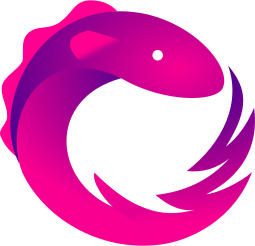
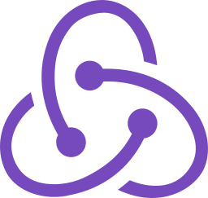

  
  
  

  

<h1 align="center">Hi , I'm Ali</h1>
<h3 align="center">Software Engineer | iOS developer | Android developer</h3>
<h4 align="center"> working remotely since 2015 🚀  </h4>

  

  
 

   

 

- 🔭 I’m currently working remotely for companies  
  

- 🌱 I’m currently learning SwiftUI  
  

- ❓  Ask me about anything related to Mobile app development  
  

- 🤝 I’m looking to collaborate with designers to create open-source apps  
  

- ⚡ Fun fact: I'm going to sleep  

   

## <b> My Skills </b>

  

  

<!-- ## <b> Tools </b>

  
&ensp;
 &ensp;
 &ensp;
 &ensp;
 &ensp;
 &ensp;
 &ensp;

 --> 

## <b> Github Stats </b> 

  
  
<!-- 

 -->  
   

<!-- ## Recent Blog Posts -->  
<!-- BLOG-POST-LIST:START -->  
<!-- If things goes well, this section should automatically be replaced by a list of your blog posts after you commit your readme file.  -->  
<!-- BLOG-POST-LIST:END -->  

   

  

   
